# Sable's Train Adventure

Drive a little red steam engine through a painted valley, pick the right track at every junction,
answer the sum (or the word puzzle) at every signal, and deliver the cargo to the station that is
waiting for it. Built for 5–10 year olds on tablets and laptops: one big power lever, big buttons,
every instruction read out loud, and a whole valley of twenty stations to unlock — Bramble Town,
the Toybox Works, Cloverfield Farm, Coalhill Mine, Herring Bay, Star Peak, Pinewood Lodge,
Coppergate City, Redsand Halt, Eagle Pass on the mountain line, and now Appleby Orchard, Mill
Ford, Windmill Hill, Greystone Quarry, Ravenstone Castle, Nugget Gulch, Honeypot Meadow, Gull
Point, Bluebell Wood and Tinker's Yard. Seven branch lines leave the main loop, and on the ledges
under the crags there are DANGER boards, and rocks that come down.

Every line is laid to railway rules: arcs of at least 65 m radius joined by straights and
reverse curves, a speed limit on every bend, both rails of every branch level with the main line
through the whole turnout, vertical curves of at least 200 m radius so no gradient ever changes in
a kink, and a self-check at boot that measures every rail head against the ground as drawn and
refuses to stay quiet if any is buried.

**Play online:** https://developmentation.github.io/sable-train-game/

The whole game is one file, `index.html` — open it in a browser and it runs. Nothing to install,
no build step. Progress (stars, deliveries, your train) is saved in the browser.

## Screenshots

| | |
|---|---|
| 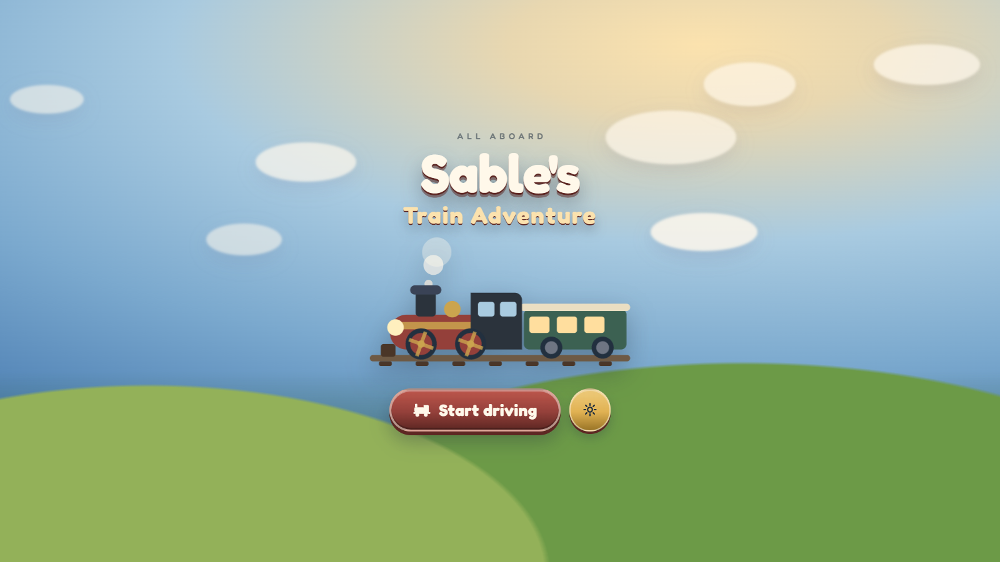 | 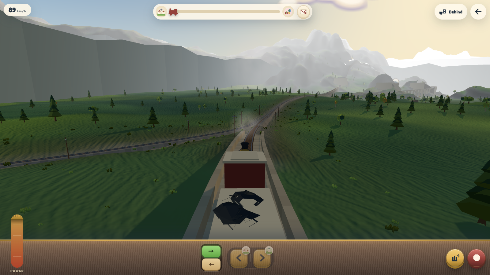 |
| *All aboard: the title card* | *Pulling out of Bramble Town on the first delivery* |
| 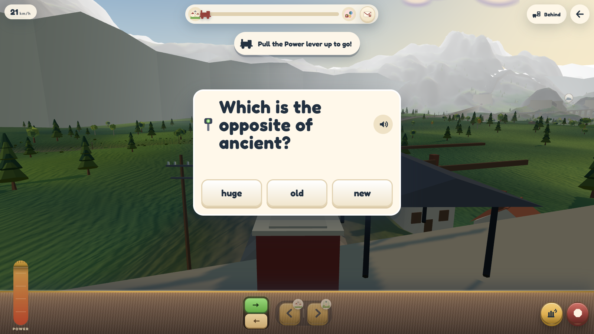 | 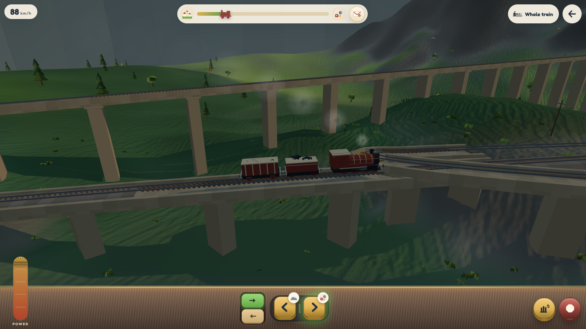 |
| *Every signal asks a sum or a word puzzle; answer it to clear the line* | *"Whole train" camera on the viaduct* |
| 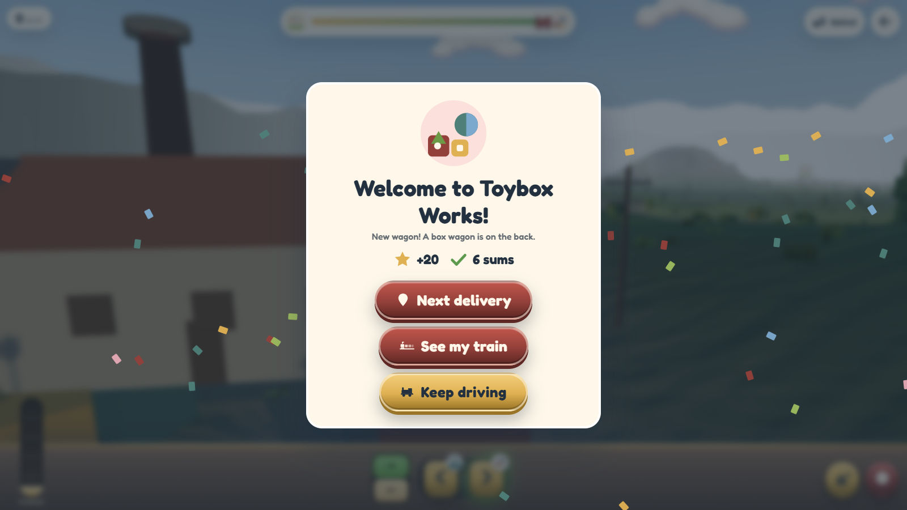 | 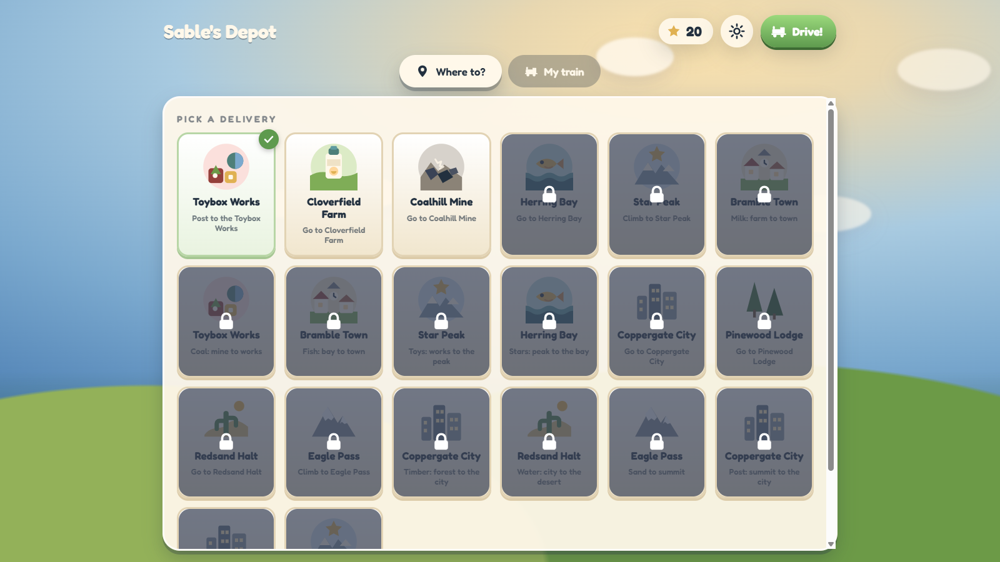 |
| *Delivery complete — stars earned, a new wagon unlocked* | *The depot: thirty-six deliveries, unlocked one at a time* |
| 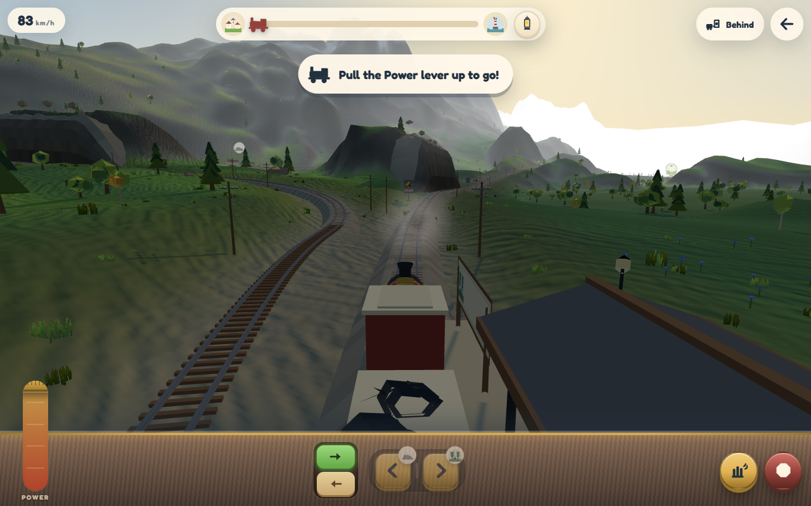 | 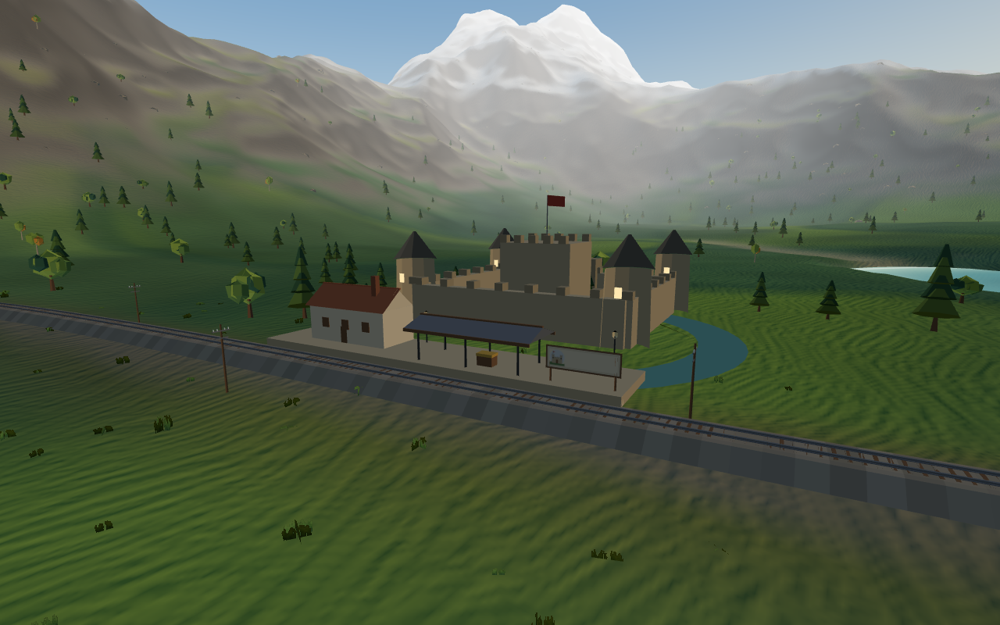 |
| *A danger zone: creep up and the plough shoves the rock off the line* | *Ravenstone Castle, on the peak line* |
| 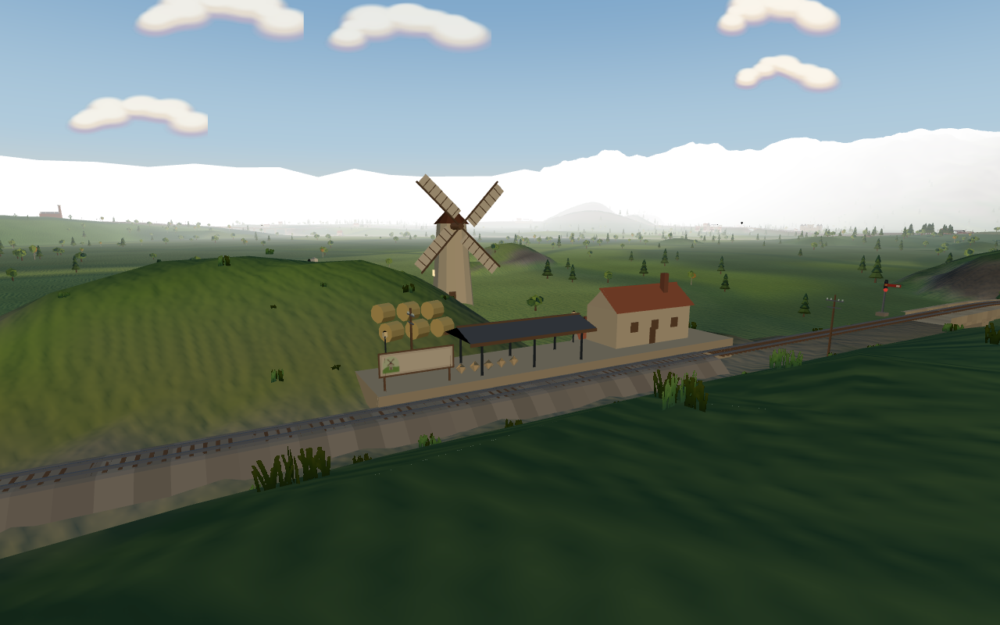 | 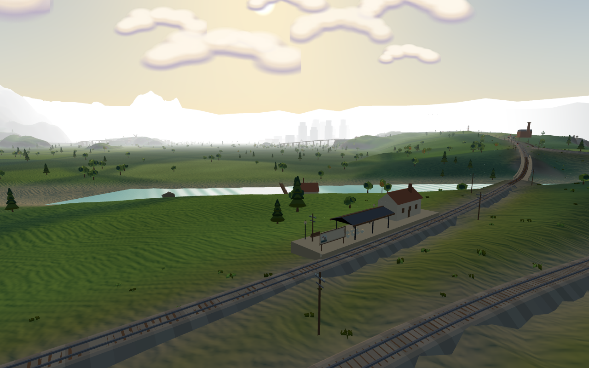 |
| *Windmill Hill, on its own loop inside the farm line* | *Mill Ford, where the main line crosses the river* |
| 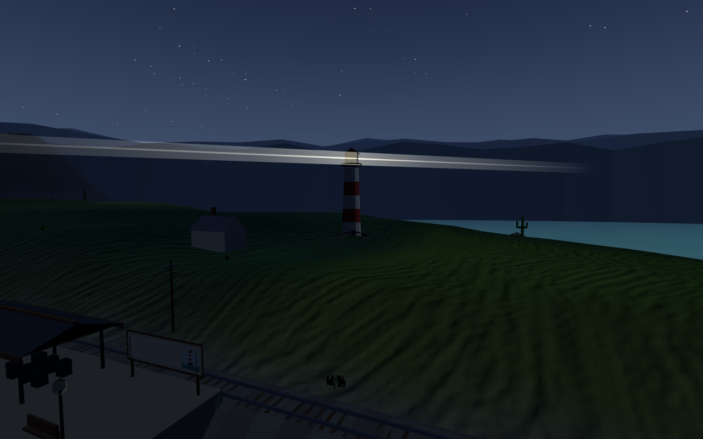 | 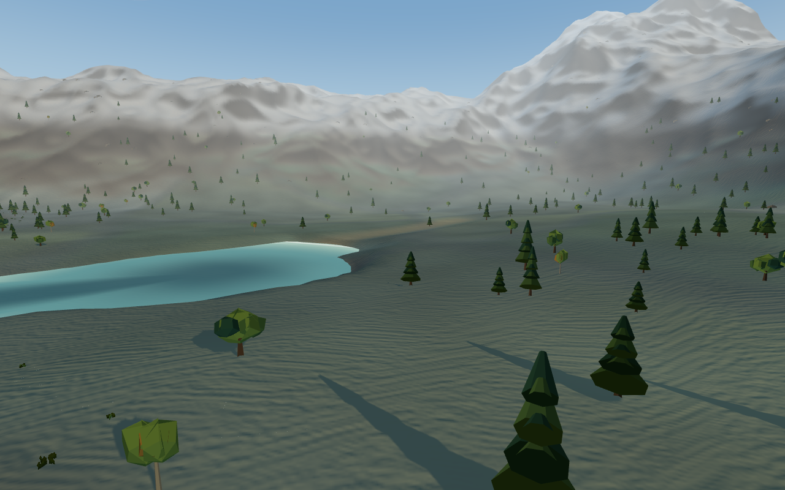 |
| *Gull Point: the lighthouse beam sweeps round all night* | *Bluebell Wood and Mirror Tarn under winter snow* |
| 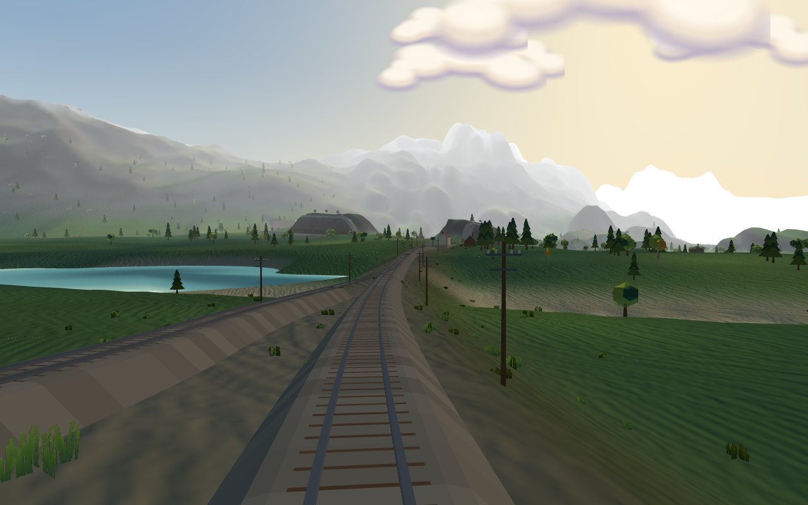 | 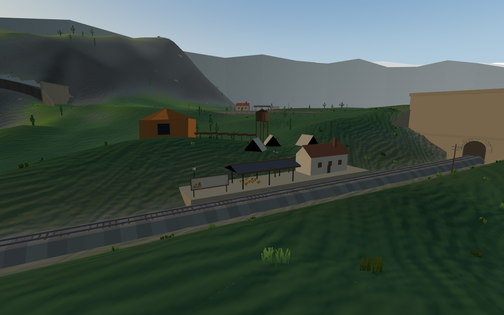 |
| *The peak line rejoining beside the tarn: every turnout is level and coplanar for its whole length* | *Nugget Gulch, second stop on the desert line* |

## How to play

1. **Start driving** — the first job is to take the post to the Toybox Works. Pull the **Power**
   lever up (or press ↑) and the train sets off.
2. **Signals** — the train stops at every signal until you answer its puzzle. Three answers are
   offered; a first-try answer earns 3 stars, a second try 2, a third 1. Number puzzles come with a
   "count the dots" picture; word puzzles are spelling, opposites and railway words.
3. **Junctions** — a fork icon appears as you approach a switch. Pick **left** or **right**
   (the ribbon at the top shows which branch leads to your station).
4. **Danger zones** — where the line runs along a ledge under a crag there is a big yellow
   DANGER board at each end. Slow down: boulders come off the rock face, and one may stop on the
   rails. Creep up to it and the engine's plough shoves it over the edge, worth 2 stars.
5. **Stations** — the train slows itself at the platform. Deliver the cargo, collect the stars,
   then pick the next delivery at the depot. Some deliveries need two stops (load milk at the
   farm, take it to town; apples from the orchard to the mill; gold from the gulch to the castle).
6. **My train** — spend the stars on wagons (coal hopper, box, tank, milk, log flat, coach, brake
   van), name your engine and repaint the body and trim.

Settings (gear button): sound, read-out-loud voice, puzzle difficulty (ages 5–6, 7–8, 9–10),
numbers / words / both, day or night, season (spring, summer, autumn, winter) and picture quality.

## Controls

| Action | Keyboard | Touch / mouse |
| --- | --- | --- |
| Power up / down | ↑ / ↓ or W / S | drag the **Power** lever |
| Pick left / right track | ← / → or A / D | ‹ › switch buttons |
| Brake | B or Shift (hold) | red button |
| Whistle | Space | yellow horn button |
| Forward / set back | R | → / ← direction buttons |
| Change camera (behind, in the cab, whole train, lineside) | C | camera button |
| Answer a puzzle | 1 / 2 / 3 | tap an answer |
| Back to the depot | Esc | ← button |
| Look around | — | drag on the world |

## Credits

Everything on screen — the valley, the trains, the stations, the icons and the sound — is generated
in code inside `index.html`; there are no image or audio assets. Third-party resources loaded at
run time:

- [three.js](https://threejs.org/) r185 (MIT), from jsDelivr.
- [Fredoka](https://fonts.google.com/specimen/Fredoka) typeface (SIL Open Font License), from Google Fonts.
- Speech uses the browser's built-in Web Speech API.
